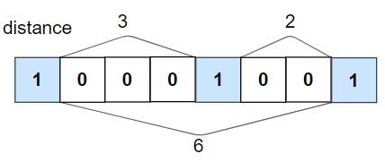
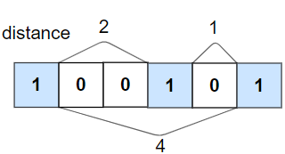

# My Solution
```cpp
class Solution {
public:
    bool kLengthApart(vector<int>& nums, int k) {
        int cnt = 0, n = nums.size();
        bool foundOne = false;
        for(int i=0;i<n;i++){
            if(nums[i]==1){
                if(foundOne && cnt<k) return false;
                cnt=0;
                foundOne = true;
            }else{
                cnt++;
            }
        }
        return true;
    }
};
```

# Problem description
```
1437. Check If All 1's Are at Least Length K Places Away

Given an binary array nums and an integer k, return true if all 1's are at least k places away from each other, otherwise return false.

 
Example 1:



Input: nums = [1,0,0,0,1,0,0,1], k = 2
Output: true
Explanation: Each of the 1s are at least 2 places away from each other.

Example 2:



Input: nums = [1,0,0,1,0,1], k = 2
Output: false
Explanation: The second 1 and third 1 are only one apart from each other.
 

Constraints:

1 <= nums.length <= 105
0 <= k <= nums.length
nums[i] is 0 or 1
```